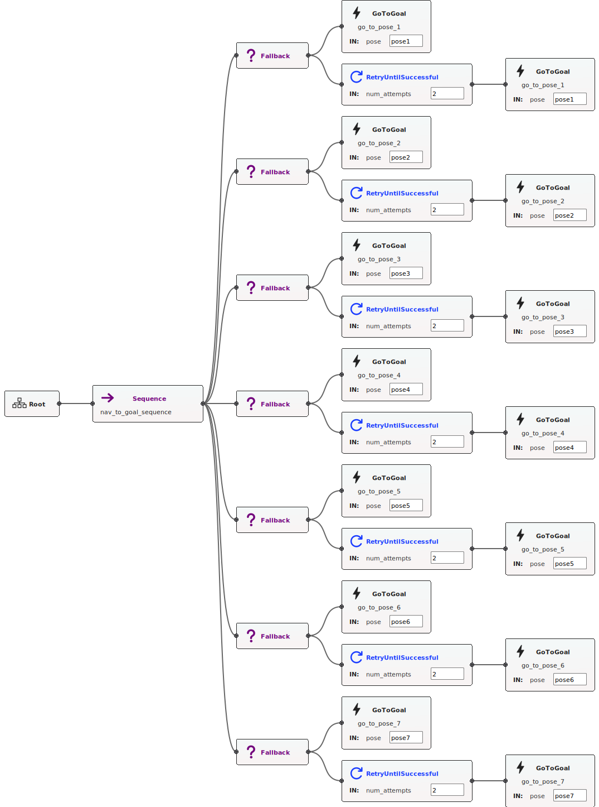

# Behavior Tree Mapping and Navigation



(Generated using Groot2)

This guide will walk you through the process of using a Behavior Tree to autonomously map an environment with seven different poses. The mapped environment can be later used for navigation. We'll use ROS2 (Robot Operating System 2) with Nav2 (Navigation 2) and Gazebo for simulation.

## Prerequisites

Before you begin, ensure that you have the following prerequisites installed:

- ROS2 Humble
- Gazebo
- Nav2 (Navigation 2)

## Setup

1. Clone this repository to your ROS2 workspace:

```bash
git clone https://github.com/Keshavraj024/bt_navigator
```

2. Build your ROS2 workspace:

```bash
cd bt_navigator && colcon build
```

## Launching the Components

Launch the components in the following order:

### Step 1: Launch Gazebo and RViz

First, launch the simulation environment with the TurtleBot, Gazebo, and RViz:

```bash
ros2 launch bt_navigator sim_turtlebot.launch.xml
```

This launch file initializes the Gazebo simulation environment, which includes the TurtleBot robot, and opens RViz for visualization.

### Step 2: Launch Navigation Stack and SLAM

Next, launch the Nav2 stack for navigation and SLAM (Simultaneous Localization and Mapping):

```bash
ros2 launch bt_navigator draw_map.launch.xml
```

This launch file sets up the navigation stack for mapping and localization. The SLAM algorithms will enable the robot to map its environment.

### Step 3: Launch the Behavior Tree Node

Finally, launch the Behavior Tree node to control the robot's mapping behavior:

```bash
ros2 launch bt_navigator bt.launch.xml
```

This launch file initiates the Behavior Tree node, which orchestrates the robot's autonomous exploration of seven different poses to map the environment.

### Step 4: Saving the Map
You can save the generated map using the nav2_map_server's map_saver_cli tool. When you are satisfied with the map, execute the following command to save it to a specified location

```bash
ros2 run nav2_map_server map_saver_cli -f path/to/save
```

## Using the Behavior Tree

The Behavior Tree is designed to autonomously navigate the robot through seven different poses. The robot will explore and map the environment, which can be later used for navigation tasks.

## Additional Information

- To customize the behavior of the Behavior Tree, you can modify the behavior tree XML file (`bt_tree.xml`) and the parameters used in the launch file.
- Make sure your robot is equipped with appropriate sensors (e.g., LIDAR) for mapping and localization.
- For safety and robustness, consider implementing recovery behaviors and user interactions within the Behavior Tree.
